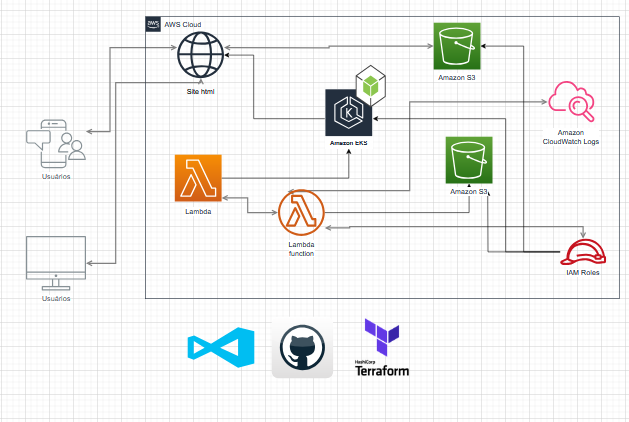

## **README.md - Projeto de CI/CD**

-----

# 🚀 Título do Projeto: [Projeto DevOps - DreamSquad]

## 📝 Descrição

Este projeto visa implementar algumas funcionalidades através de três serviços, como uma aplicação frontend rodando a partir do S3, uma aplicação backend com alguma funcionalidade básica e a implementação de lambda para um processo programado em determinado horário. Foi aplicado no projeto a integração com o GitHub de forma manual, para manter um repositório ativo e na sequência, implementação do CI/CD utilizando o GitHub Actions.



## 🛠️ Tecnologias e Ferramentas Utilizadas

A seguir, estão as principais tecnologias e ferramentas que compõem nossa pipeline:

### **Integração Contínua (CI)**

| Categoria | Ferramenta | Descrição |
| :--- | :--- | :--- |
| **Controle de Versão** | **[ Git / GitHub ]** | Hospedagem e controle do código-fonte. |
| **Orquestrador CI** | **[ GitHub Actions ]** | Gerencia e executa a esteira de build e testes. |
| **Linguagem/Runtime** | **[ HTML, CSS e javascript para a aplicação Frontend, Python para o Lambda e Node.js para a aplicação backend ]** | Linguagem de desenvolvimento da aplicação. |
| **Gerenciador de Pacotes** | **[ npm, pip]** | Gerencia as dependências do projeto. |
| **Testes** | **[ Ainda não foi implementado ferramentas de testes, mas utilizaremos Selenium]** | Frameworks para testes unitários e de integração. |

### **Entrega Contínua (CD)**

| Categoria | Ferramenta | Descrição |
| :--- | :--- | :--- |
| **Containerização** | **[ Docker ]** | Empacota a aplicação e suas dependências em imagens. |
| **Registro de Imagens** | **[ AWS ECR ]** | Armazena as imagens Docker prontas para deploy. |
| **Orquestração** | **[ AWS EKS ]** | Gerencia e escala os contêineres em produção. |
| **Nuvem/Infraestrutura** | **[ AWS ]** | Plataforma de hospedagem do ambiente. |
| **IaC (Infraestrutura como Código)** | **[ Terraform ]** | Automatiza o provisionamento da infraestrutura. |

## ⚙️ A Esteira de CI/CD (Após implementar o GitHub Actions)

Nossa pipeline de CI/CD é estruturada nas seguintes fases:

1.  **Commit (CI):**
      * Um desenvolvedor faz um `push` de código para o branch **`main`** (ou um *merge* de *feature branch*).
2.  **Build (CI):**
      * O Orquestrador **[Ferramenta CI]** é acionado.
      * As dependências são instaladas e o código é compilado.
      * Uma imagem **Docker** é construída.
3.  **Testes (CI):**
      * Testes **Unitários** e de **Integração** são executados automaticamente.
      * Verificação de **Qualidade de Código** (**[Ex: SonarQube]**) é realizada.
4.  **Artefato (CD):**
      * A imagem Docker é **taggeada** (ex: com o número do build) e enviada ao **[Registro de Imagens]**.
5.  **Deploy em Staging (CD):**
      * O ambiente de **Staging** (homologação) é atualizado com o novo artefato.
      * **Testes de Aceitação** automatizados (**[Ex: Selenium, Cypress]**) são executados neste ambiente.
6.  **Aprovação Manual:**
      * Após a validação em Staging, uma **aprovação manual** é necessária para prosseguir.
7.  **Deploy em Produção (CD):**
      * A implantação é feita no ambiente de **Produção** usando **[Ferramenta CD/IaC]**, seguindo uma estratégia de deploy segura (ex: *Rolling Update* ou *Canary Deployment*).

## 📄 Estrutura do Repositório

```
.
├── app/                          # Código-fonte da aplicação frontend
|   |__ index.html
|   |__ error.html
|   |__ script.js
|   |__ styles.css                        
├── backend/                      # Armazena os códigos do Dockerfile, package.json, server.js
|   |__ public
|   |__ Dockerfile
|   |__ package.json
|   |__ server.js
├── terraform/                    # Scripts terraform e do lambda
│   ├── kubernetes.tf             # Código do provisionamento do cluster EKS
│   ├── lambda_function.py        # Código do lambda
│   └── main.tf                   # Código para os buckets, permissões e outras coisas
|   |__ outputs.tf                # Código para apresentar o output de site, alb e ecr
|   |__ provider.tf               # Código com os providers da AWS e do Kubernetes
|   |__ variables.tf              # Código com definição de variaveis
|__ .gitignore                    # Código para que o github ignore partes do projeto que não devem
|                                 # ficar expostas no repositorio
└── README.md
```

## 🧑‍💻 Implementações futuras

Para futuro próximo, espera implementar muitas outras coisas como Ansible, Slack, Testes unitários, e praticas SRE com observalidade em Prometheus/Grafana:

## 📄 Como implementar o código passo a passo

-----

Este é o passo a passo detalhado para configurar seu projeto, infraestrutura com **Terraform** na AWS e preparar o versionamento no **GitHub**, seguindo o fluxo de desenvolvimento local e deploy manual inicial.

-----

## 🛠️ Passo a Passo Detalhado: Terraform, AWS e GitHub

Este guia é focado na configuração inicial do ambiente e da infraestrutura (IaC), preparando o terreno para a automação CI/CD que ocorrerá posteriormente no GitHub Actions.

### Fase 1: Configuração AWS e Estrutura Local

#### 1\. Configuração de Credenciais AWS

Antes de começar, você precisa garantir que o Terraform possa interagir com sua conta AWS.

  * **Configuração Local (CLI):** Crie um **usuário IAM** com as permissões necessárias para o Terraform (ex: criar S3, Lambda, API Gateway, etc.). Configure o **AWS CLI** em seu computador com as chaves de acesso (`aws configure`).
    > **Atenção:** Para o pipeline do GitHub Actions, você precisará configurar um conjunto de chaves de acesso separadas como **GitHub Secrets** posteriormente.

#### 2\. Estrutura de Diretórios

Organize seu projeto localmente com as seguintes pastas na raiz:

  * **`terraform/`**: Contém todos os arquivos de **Infraestrutura como Código (IaC)**, como os arquivos `.tf`.
  * **`app/`**: Contém os arquivos da sua **aplicação frontend/estática** (ex: `index.html`, `styles.css`).

#### 3\. Desenvolvimento do Backend (AWS Lambda)

Se o seu projeto incluir uma função de backend, siga estes passos para empacotá-la antes do `terraform apply`:

1.  Crie o arquivo **`lambda_function.py`** dentro do diretório **`terraform/`** com o código da sua função AWS Lambda.

2.  **Crie o arquivo ZIP** para que o Terraform possa fazer o upload:

    | Sistema Operacional | Comando para Compactar |
    | :--- | :--- |
    | **Linux/macOS** | `zip lambda_function.zip lambda_function.py` |
    | **Windows (PowerShell)** | `Compress-Archive -Path lambda_function.py -DestinationPath lambda_function.zip` |

### Fase 2: Configuração e Deploy da Infraestrutura (Terraform)

Nesta fase, você criará todos os recursos necessários na AWS (S3, Lambda, API Gateway, etc.).

#### 4\. Inicialização e Aplicação do Terraform

1.  Navegue até a pasta **`terraform/`** e execute os comandos principais para gerenciar sua infraestrutura:

    ```bash
    cd terraform
    terraform init
    terraform plan
    terraform apply
    ```

      * **`terraform init`**: Inicializa o diretório de trabalho.
      * **`terraform plan`**: Mostra o que será criado/modificado/destruído.
      * **`terraform apply`**: **Aplica** as mudanças, criando os recursos AWS.

    > **Nota:** Se você desenvolveu o código backend no Passo 3, o `terraform apply` irá criar a função Lambda e a infraestrutura de backend.

#### 5\. Deploy da Aplicação Estática (Frontend)

Com o *bucket* S3 criado pelo Terraform, sincronize seus arquivos de frontend para ele.

1.  **Obtenha o Nome do Bucket:** O Terraform deve ter fornecido o nome do bucket S3 como um **output** no prompt (`bucket_name`).

2.  **Sincronize os Arquivos:** Volte para a **raiz do projeto** e execute:

    ```bash
    cd ..
    aws s3 sync app/ s3://${bucket_name}/ --delete
    ```

    > O comando `aws s3 sync` garante que o conteúdo do S3 reflita exatamente o conteúdo da sua pasta `app/`.

### Fase 3: Teste da Aplicação

#### 6\. Teste Funcional

1.  **Teste do Site (Frontend):** Pegue o endereço da URL do site (também fornecido como **output** do Terraform) e acesse-o no navegador.
      * Se não funcionar, verifique as permissões do S3. Em alguns casos, pode ser apenas **cache** do navegador – tente limpar ou usar uma aba anônima.
2.  **Teste da API (Backend):** Use o **output** do Terraform que fornece o endpoint do **API Gateway** ou da **função Lambda** para testar se o backend está funcionando corretamente.

### Fase 4: Versionamento e GitHub

#### 7\. Configuração do Repositório Git

1.  **Crie o Repositório Remoto:** Crie um novo repositório no GitHub (ou outra plataforma) com o nome do seu projeto.

2.  **Inicialize o Git Local:** Na **raiz do projeto**, inicialize o Git:

    ```bash
    git init
    ```

3.  **Adicione e Commite:**

    ```bash
    git add .
    git commit -m "Primeiro commit: adicionando arquivos do projeto"
    ```

4.  **Conecte e Envie para o GitHub:**

    ```bash
    git remote add origin URL_DO_REPOSITORIO
    git branch -M main
    git push -f origin main
    ```

    > O `push -f` (force) é usado aqui para sobrescrever qualquer arquivo inicial que o GitHub possa ter criado (como o README). **Use `push -f` com cautela em projetos colaborativos.**

Com este passo a passo concluído, seu código e sua infraestrutura estão prontos para que você comece a criar o pipeline automatizado de **CI/CD** usando o **GitHub Actions**.
-----

*Este projeto é mantido pela Equipe de DevOps.*